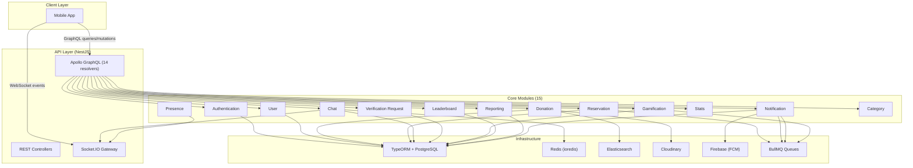

# Gazp Zero — Backend

Backend for **Gazp Zero**, a community-driven food-waste reduction platform. Users discover and reserve surplus food donations nearby, chat in real time, build reputation through a gamification system, and verify their identity via food savers.

---

## Tech Stack

| Layer | Technology |
|---|---|
| **Runtime** | Node.js + NestJS |
| **API** | GraphQL (Apollo Server) |
| **Database** | PostgreSQL + TypeORM |
| **Cache** | Redis (`ioredis`) |
| **Job Queue** | BullMQ (Redis-backed) |
| **Search** | Elasticsearch |
| **Auth** | Passport — JWT + Local + Google OAuth 2.0 |
| **Real-time** | Socket.IO + Redis adapter |
| **Storage** | Cloudinary |
| **Push** | Firebase Cloud Messaging |
| **Monitoring** | Winston + Loki + Terminus health checks |
| **Docs** | Swagger/OpenAPI + Scalar UI + Bull Board |

---

## Folder Structure

```
src/
├── common/                     # Shared modules, filters, interceptors, types, utils
│   ├── constants/              # App-wide constants (jobs, queues)
│   ├── errors/                 # Error codes & error module
│   ├── filter/                 # Global exception filters
│   ├── interceptors/           # Logging & response formatting
│   ├── modules/                # Shared modules
│   │   ├── als/                # AsyncLocalStorage (request context)
│   │   ├── attachment/         # Attachment entity & management
│   │   ├── dataloader/         # GraphQL DataLoaders (7 loaders)
│   │   ├── email/              # Handlebars email templates + sending
│   │   └── upload/             # Multer file upload handling
│   ├── scripts/                # DB seed scripts & utilities
│   ├── types/                  # Shared TypeScript types
│   └── utils/                  # Common helpers
│
├── config/                     # Centralized config (app, auth, db, redis, mail, cloud, es, firebase)
│
├── core/                       # Feature modules — business logic
│   ├── authentication/         # Register, login, JWT, Google OAuth, guards, strategies, decorators
│   ├── user/                   # User CRUD, profile, settings, admin user management
│   ├── category/               # Food donation categories
│   ├── donation/               # Donations CRUD, geolocation, heatmaps, photos, likes
│   ├── reservation/            # Donation reservation workflow
│   ├── reservation-completion/ # Reservation transaction completion
│   ├── chat/                   # Real-time chat (messages, conversations, state machine)
│   ├── notifications/          # Push notifications + pub/sub events
│   ├── gamification/           # Badges & achievements system
│   ├── leaderboard/            # Reputation leaderboard & reputation logs
│   ├── reporting/              # User reporting & moderation
│   ├── stats/                  # Admin dashboard statistics
│   ├── presence/               # Online/offline user presence
│   ├── verification-request/   # Identity verification by food savers
│   ├── websocket/              # Global WebSocket connection manager
│   └── core.module.ts
│
├── infrastructure/             # Infrastructure services
│   ├── cloudinary/             # Cloudinary image upload wrapper
│   ├── clusters/               # Node.js cluster mode service
│   ├── db/                     # TypeORM data source, migrations
│   ├── firebase/               # Firebase Admin SDK (FCM push)
│   ├── queue/                  # BullMQ queues (mail, chat, notification, upload, search, gamification...)
│   └── search/                 # Elasticsearch indexing & search
│
├── monitoring/                 # Health checks, logging, alerting
├── security/                   # Rate limiting & security policies
├── app.module.ts               # Root module
└── main.ts                     # Bootstrap entry point
```

---

## Prerequisites

- **Node.js** >= 22
- **pnpm** >= 10
- **PostgreSQL**, **Redis**, **Elasticsearch** (see Docker section below for a quick spin-up)

## Setup & Run

```bash
# Clone the repo
git clone <repo-url>
cd backend

# Install dependencies
pnpm install

# Setup environment
cp .env.example .env
# Fill in your DB, Redis, Mail, JWT, Cloudinary credentials

# Run migrations
pnpm migration:run

# Seed sample data (optional)
pnpm seed:all

# Start in development mode
pnpm start:dev
```

## Docker

### Infrastructure Services

Spin up PostgreSQL, Redis, and Elasticsearch locally:

```bash
docker run -d --name gazp-postgres   -e POSTGRES_USER=postgres   -e POSTGRES_PASSWORD=password   -e POSTGRES_DB=myapp   -p 5433:5432   postgres:16-alpine

docker run -d --name gazp-redis      -p 6380:6379   redis:7-alpine

docker run -d --name gazp-elastic    -e "discovery.type=single-node"   -e "xpack.security.enabled=false"   -p 9200:9200   elasticsearch:8.15.0
```

Then update your `.env` with `DB_HOST=localhost`, `DB_PORT=5433`, `REDIS_HOST=localhost`, `REDIS_PORT=6380`.

### App via Docker

Build and run the application itself using the provided Dockerfiles:

**Development** (hot-reload):
```bash
docker build -f Dockerfile.development -t gazp-backend:dev .
docker run -d --name gazp-backend   --env-file .env   --network host   gazp-backend:dev
```

**Production**:
```bash
docker build -f Dockerfile.production -t gazp-backend:prod .
docker run -d --name gazp-backend   --env-file .env   -p 8080:8080   gazp-backend:prod
```

---

## Scripts

| Script | Description |
|---|---|
| `pnpm start:dev` | Start with hot-reload |
| `pnpm start:prod` | Build & start in production |
| `pnpm build` | Compile TypeScript |
| `pnpm migration:generate` | Generate TypeORM migration |
| `pnpm migration:run` | Run pending migrations |
| `pnpm migration:revert` | Revert last migration |
| `pnpm seed:all` | Seed all sample data |
| `pnpm seed:users` / `:donations` / `:reservations` / ... | Seed individual entities |
| `pnpm lint` | Lint with oxlint |
| `pnpm lint:fix` | Auto-fix lint issues |
| `pnpm test` | Unit tests |
| `pnpm test:e2e` | End-to-end tests |
| `pnpm test:all` | Unit + E2E tests |

---

## Core Features

### Authentication
- JWT access + refresh token rotation
- Local strategy (email/password)
- Google OAuth 2.0
- Role-based guards (`FoodSaverGuard`, `RolesGuard`, `SameNeighborhoodGuard`)

### Donations & Reservations
- Geolocation-based donation discovery with heatmaps and map markers
- Neighborhood-based filtering (zip code matching)
- Reservation workflow with expiry timers (BullMQ)
- Photo uploads via Cloudinary

### Real-time Chat
- Socket.IO with Redis adapter for horizontal scaling
- Chat state machine (active → accepted → completed)
- Per-conversation WebSocket rooms
- Presence tracking (online/offline)

### Gamification & Reputation
- Badge & achievement system
- Reputation leaderboard
- Auto-promotion to food saver based on reputation score
- Auto-verification of donors after threshold donations

### Notifications
- Firebase Cloud Messaging (FCM) for push
- Smart notification system with pub/sub events
- Token management for multiple devices

---

## API Documentation

GraphQL Playground available at:
```
http://localhost:3000/graphql
```

Swagger/OpenAPI reference at:
```
http://localhost:3000/docs
```

Bull Board (job monitoring) at:
```
http://localhost:3000/bull-board
```

---

## Architecture




---

## WebSockets

- **Single-user messaging** via authenticated Socket.IO rooms
- **Distributed scaling** via `@socket.io/redis-adapter`
- Base WebSocket gateway in `src/core/websocket/` with auth guards
- Chat state machine in `src/core/chat/`

---

## Security

- **Helmet** for HTTP security headers (CSP configured for Scalar UI)
- **CSRF** via double-submit cookie strategy
- **Rate limiting** via `@nestjs/throttler`
- **Validation** with `class-validator` + global `ValidationPipe`

---

## Health Checks

Powered by `@nestjs/terminus` at:
```
GET /health
```
Checks: PostgreSQL, Redis, Elasticsearch, and more.

---

---

## License

MIT © 2025 Mouloud Hasrane

## Author

Mouloud Hasrane

## Contact

[mouloudhasrane@gmail.com](mailto:mouloudhasrane@gmail.com)
